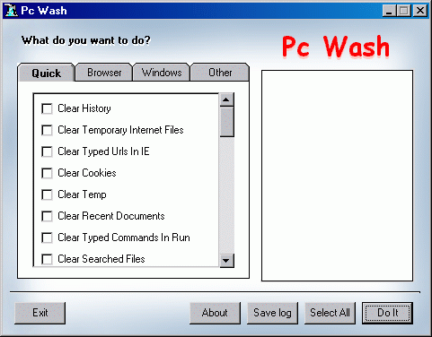



## Privacy Cleaner

### Description

This program can clean: IE History, IE temporary files, IE typed urls, Cookies, Temp, recent documents, typed commands in run, searched files, WMP recent files, ...
 
### More Info
 

             |
---                |---
**Submitted On**   |2004-08-09 09:55:12
**By**             |[Farshad Shahbazi](https://github.com/Planet-Source-Code/PSCIndex/blob/master/ByAuthor/farshad-shahbazi.md)
**Level**          |Intermediate
**User Rating**    |4.2 (38 globes from 9 users)
**Compatibility**  |VB 6\.0
**Category**       |[Complete Applications](https://github.com/Planet-Source-Code/PSCIndex/blob/master/ByCategory/complete-applications__1-27.md)
**World**          |[Visual Basic](https://github.com/Planet-Source-Code/PSCIndex/blob/master/ByWorld/visual-basic.md)
**Archive File**   |[Privacy\_Cl184949272005\.zip](https://github.com/Planet-Source-Code/farshad-shahbazi-privacy-cleaner__1-58753/archive/master.zip)

